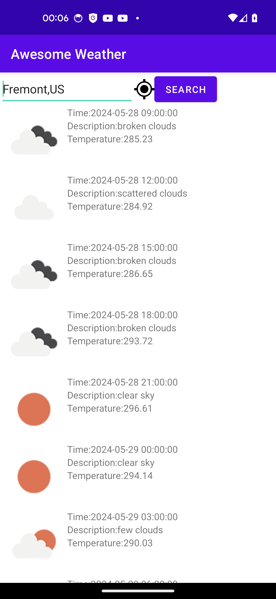
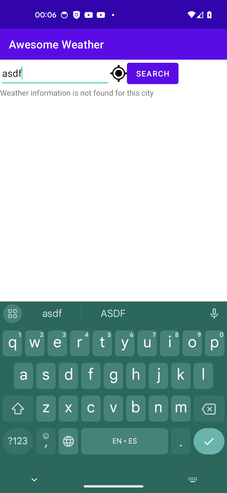
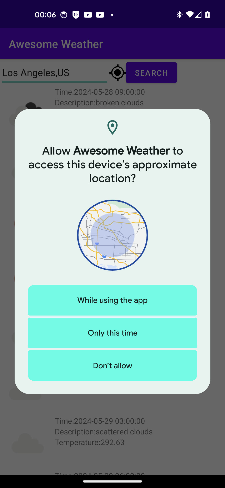

# Summary
This app lets customers search for weather data for a U.S. city by name.

# Tech Stacks
- Architecture Pattern: MVVM
- Dependency Injection: Hilt
- Network Library: Retrofit
- Image Library: Glide
- Concurrency: Kotlin Coroutine, Kotlin Flow
- Unit Test: JUnit, Mockk

# Implemented Features
1. When a customer enters a city's name and presses the Search button, 5-day weather information will be displayed with a 3-hour step.
2. When a customer clicks on the icon to weather data for the current location, a UI will be displayed to require location permissions.
3. If a customer enters a city that cannot be found by the backend service, an error message will be displayed. 
4. The last searched city and weather data will be displayed when the app launches.

# Screenshots

  
  
  

# Future Improvements
1. Given more time, we can implement autocomplete when a customer enters the city name for a better user experience.
2. Given more time, we can support search by zipcode.
3. Given more time, we can let users choose between metrics and imperial units.
4. Remove the API key from the source code to improve security. For example, we can use Github secrets ([reference](https://medium.com/make-android/how-to-safeguard-your-api-keys-in-android-projects-with-github-secrets-5679e0e89a77)).

# openweathermap APIs
- [5-day weather forecast](https://openweathermap.org/forecast5#builtin)
- [Weather Icons](https://openweathermap.org/weather-conditions#How-to-get-icon-URL)
